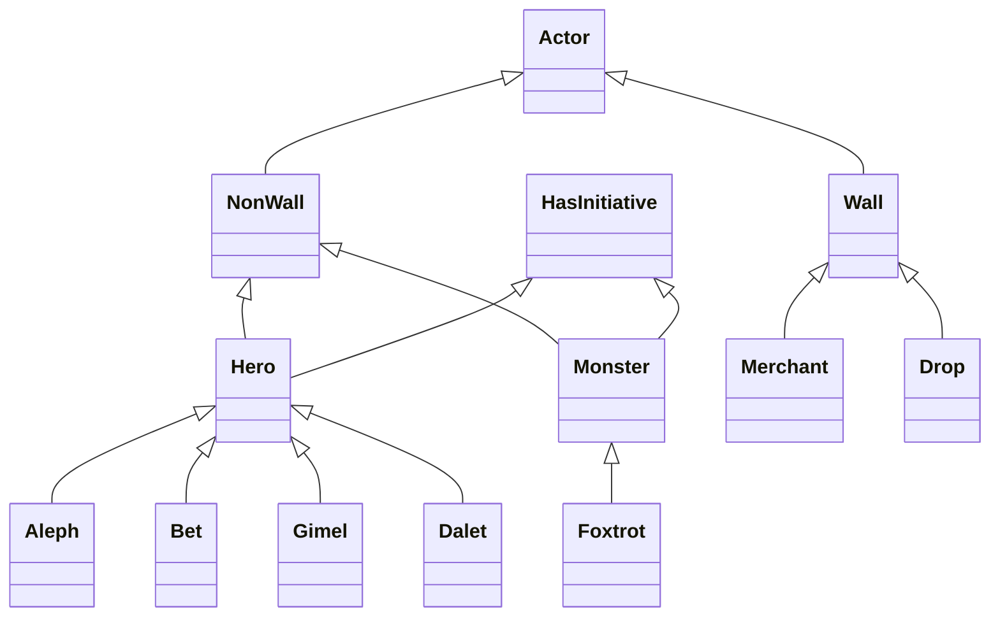

#  PokéBowl© RPG

> *Nintendo, please don't sue us. Sue Kerney for appproving this project instead.*

## What's this game about?
*PokéBowl©* is a Pokemon-inspired, singleplayer, console-based RPG.

- Hassle-free experience! Just clone our repo, `make`, run `a.out`, and be in awe.
- Explore the One Great Lake with arrow keys (⬅️⬆️⬇️➡️), meet your heroes, access your own inventory (`i`, `e`), and complete quests.
- See your Heroes fighting monsters at first contact. Let Dalet heal companions, and protect them from Delta's one-shot punch.

**Defeat Foxtrot the Boss, kill all her monsters** to win and conquer the Poké-verse!

## Key commands
| Key | Action |
|-----|--------|
| `⬅️⬆️⬇️➡️` | Move player |
| `i` | Open inventory |
| `e` | Open equipment table |
| `q` | Quit game |

## Checklist, 1 2 3
 
### Group

#### Quality
- `🚧` **A)** Fun to play — *Everyone*
- `🚧` **B)** Decent amount of content / take at least a little while to win — *Everyone*
- `🚧` **C)** Has an interesting world map in color — *McKay*
- `✅` **D)** Win and lose — *name*
- `🚧` **E)** Combat — *name*
  
#### Documentation
- `🚧` **A)** README describes game: directions to win, key commands, CLI params — *Tony*
- `✅` **B)** README uses Markdown: bullet points, colors, embedded logo image — *Tony*
- `🚧` **C)** README lists all contributors with who did each bullet point (group + individual); undone items noted — *Tony*

#### Consistency of work
- `✅` **A)** Screenshot of game state, 1 week (embedded below) — *Tony*
- `🚧` **B)** Screenshot of GitHub commit log showing consistent commits over time (embedded below) — *Tony*
 
### Individual
 
#### A — "Inheritor of Suffering" (Tony)
- `✅` Pure virtual / abstract `Actor` class
- `✅` Stationary objects, Heroes, Monsters inheriting from `Actor`
- `✅` `Hero` class with 4+ subclasses (Hebrew alphabet, Aleph -> )
- `✅` `Monster` class with 5+ subclasses (stub, stub, stub, stub, stub, stub) including a **Boss** (killing Boss = win condition)
- `✅` Player controls a party of 4–6 heroes, walks around, kills monsters, does quests
- `🚧` README:  +  + 
 
#### B — "BRIDGEngineer" (George)
- `✅` `HasInitiative` class with `speed` member (1–40); Hero and Monster inherit from it
- `✅` On combat start: roll d20 + speed, sort fastest-first into circular linked list
- `✅` Circular linked list for turn order: advance on turn end, wrap at tail, remove on death
- `🚧` Snapshot command sends current turn order visualization to BRIDGES at any point in combat
- `✅` Works for any combat
- `✅` Each BRIDGES node labeled with actor name + initiative value
- `💢` Screenshot of BRIDGES combat visualization embedded in README
 
#### C — "JJK Curse Lord" (McKay)
- `✅` ncurses full-screen UI in raw mode, no Cin/Cout line scrolling
- `✅` Arrow key movement
- `✅` Color
- `✅` Scrollable world map with towns, lakes, and other features
- `💢` Combat displayed on screen
- `✅` Inventory displayed on screen
- `🚧` Party moves on map when arrow keys pressed
- `✅` Demonstrates reasonable ncurses proficiency
 
#### D — "Sephiroth, Master of the Tree" (Jovanni)
- `✅` BST inventory system using **`custom BST`**
- `✅` Print all items in inventory in alphabetical order —
- `✅` Support multiple copies of same item
- `✅` Pick up and drop items
- `✅` Buy items with gold from merchant; sell non-Key Items to merchant
- `✅` Key Items: cannot be dropped; removed only by completing their quest
- `✅` Monsters have randomly generated inventories that drop on defeat
- `✅` Items have varied stats (damage, speed modifier, healing amount, merchant cost, etc.)
- `✅` Coordinated with McKay (C) for inventory display, Tony (A) for hero/monster inventory ownership
 
#### E — "Scared Balloon" (Dillion)
- `✅` Dynamic weather system
- `🚧` Quest system
- `✅` Hash table implemented and used as part of the system

## Screenshots

### Commit log


<em>Week 1 commit log</em>

### Game state at week 1


### BRIDGES combat

```
[ unimplemented.png ]
```

### `Actor` class
[desc]

#### Class diagram



#### Code snapshots

https://github.com/Clovis-Community-College/rpg-41-pokebowl/blob/6236090369d2f0ee958df19724e527a4e8da4ed1/actor.h#L1-L334

https://github.com/Clovis-Community-College/rpg-41-pokebowl/blob/6236090369d2f0ee958df19724e527a4e8da4ed1/actor.cc#L1-L326
